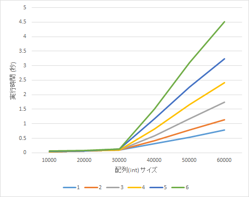
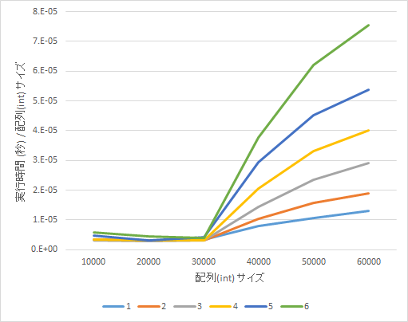

[スリザーリンクジェネレータ](https://github.com/semiexp/penciloid2) を動かしていたら，「ある程度大きい問題を」「背理法ありで」「複数スレッドで」自動生成したときに CPU 使用率があまり上がらないという現象に遭遇した．
スレッド数を増やしていくと CPU 使用率も 100% に近づくはずであるが，多数のスレッド（20 スレッドくらい）を使わせても CPU 使用率が 40% くらいまでしか上がらなくなってしまう．
問題のサイズが小さいときや，背理法を使わないときにはこの現象は発生しない．
これでは効率が悪そうで困るので，原因を調べてみた．

## 環境

|OS	|Windows 10 の WSL 上の Ubuntu 14.04	|
|CPU	|Intel Core i7-5930K (6 コア 12 スレッド)	|
|メモリ	|DDR4 8GB * 4	|
|コンパイラ	|gcc 4.8.5	|

CPU が 12 スレッドなので，12 スレッド以上を指定したら CPU 使用率が 100% 近くなるべきである．

## 原因？

背理法を実行する関数内では，盤面のコピーが頻繁に行われる．コピーの過程で new により新たな盤面のための領域が確保される．
new 以外に複数スレッドで効率が悪くなりそうな箇所はなかったので（自動生成では基本的にスレッド間は問題が完成したとき以外干渉しない）この盤面の頻繁なコピーが原因ではないかと考え，単に盤面をコピーしまくるコードを動かしたら同様に CPU 使用率が悪化した．

ということで，大きい配列を確保するときの new の挙動が原因に見えるので，次のようなコードをコンパイルして実験した．


#include <cstdio>
#include <thread>
#include <chrono>
#include <vector>
#include <cstdlib>
#include <iostream>
#include <random>
#include <cstring>

using namespace std;

double experiment(int n_thread, int sz)
{
	auto worker = [&](int seed) {
		const int N = 10000;
		mt19937 rnd(seed);

		for (int i = 0; i < N; ++i) {
			int len = sz;
			int *ary = new int[len];
			std::fill(ary, ary + len, 12345);
			int sum = 0;
			for (int j = 0; j < len; ++j) sum += ary[j];
			delete[] ary;
		}
	};
	vector<thread> vec;
	auto start = chrono::system_clock::now();
	for (int i = 0; i < n_thread; ++i) {
		vec.push_back(thread(worker, i));
	}
	for (int i = 0; i < n_thread; ++i) {
		vec[i].join();
	}
	auto end = chrono::system_clock::now();
	double elapsed = chrono::duration_cast<chrono::microseconds>(end - start).count() / 1e6;

	return elapsed;
}

int main()
{
	for (int t = 1; t <= 6; ++t) {
		for (int sz : {10000, 20000, 30000, 40000, 50000, 60000}) {
			cout << experiment(t, sz) << "\t";
		}
		cout << endl;
	}
	return 0;
}


実験結果は下の通り．

配列サイズが 40000 以上だと，30000 以下に比べて明らかに (配列サイズに対する) 実行時間が増加していることがわかる．
また，配列サイズが 40000 以上では，スレッド数の増加に対する所要時間の増大が大きい (CPU は 6 コアなので，理想的には 6 コアまではほとんど所要時間は増加しないでほしい)．
この傾向は，下のグラフ (縦軸は，実行時間 / 配列サイズ) を見るとより明らかになる．

確保サイズが大きいと，メモリ確保処理がスレッドローカルでなくなり，排他処理がかかっているかのような挙動である．
最初の「CPU 使用率があまり上がらない」問題に対しては，次のような理由が考えられる：

- 問題サイズが大きいと，new において時間がかかりかつ複数スレッドでの効率が悪くなり，スレッドが new のために待たされるようになる．
